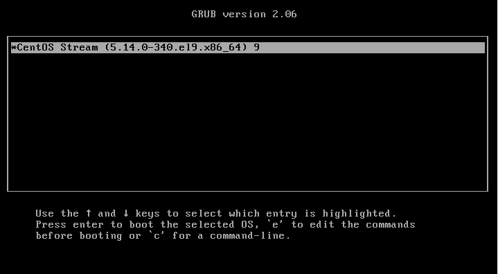
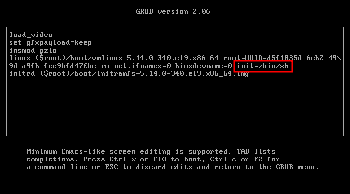
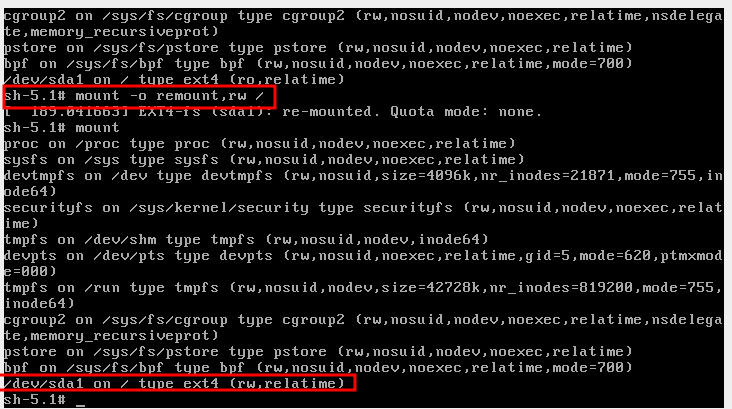
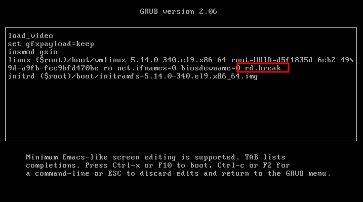
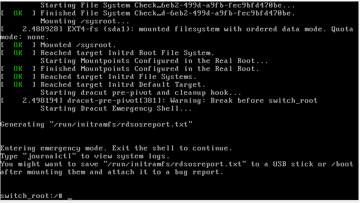
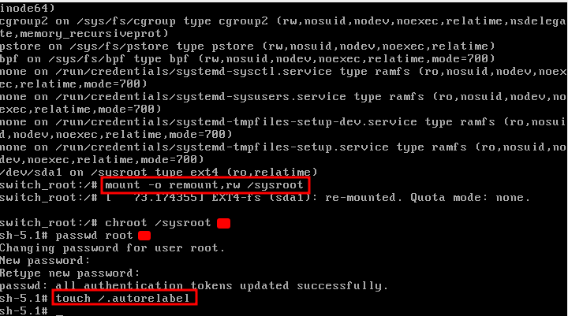
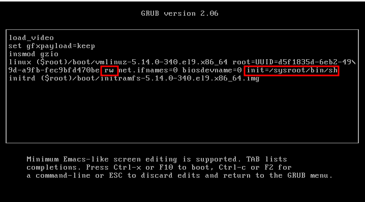
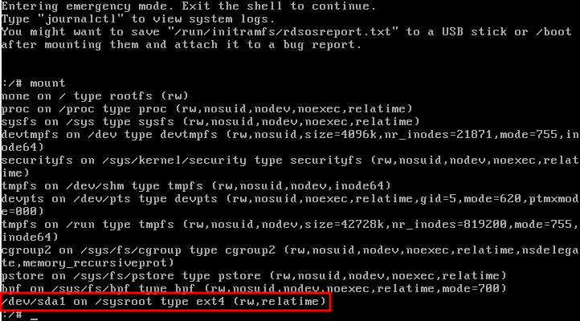
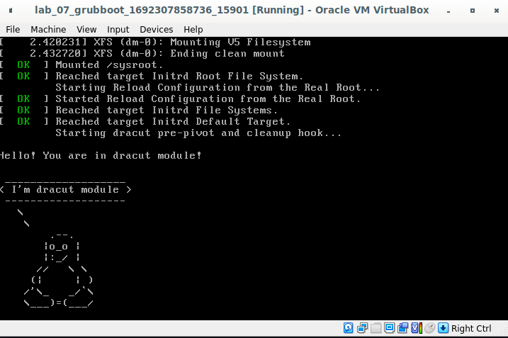

# Загрузка Linux

**Задание:** 
* Попасть в систему без пароля несколькими способами;
* Установить систему с LVM, после чего переименовать VG;
* Добавить модуль в `initrd`;
* (*) Сконфигурировать систему без отдельного раздела с `/boot`, а только с LVM

## 01. Научиться попадать в систему без пароля
В данном случае был выбран образ `Centos Stream 9`, т.к. обычный образ `Centos 7` падал с `kernel panic` при изменении boot настроек.


### I init=/bin/bash






### II rd.break






### III rw init=/sysroot/bin/sh





## 02. Установить систему с LVM, после чего переименовать VG

Узнаем название текущей VG и поменяем его на OtusRoot

```bash
# Название VG: "centos_centos7"
[root@grub vagrant]# vgs
  VG             #PV #LV #SN Attr   VSize    VFree
  centos_centos7   1   2   0 wz--n- <127,00g    0

[root@grub vagrant]# vgrename centos_centos7 OtusRoot
  Volume group "centos_centos7" successfully renamed to "OtusRoot"
```

Теперь поменяем название в `fstab`, `grub` файлах и сгенерируем новый `grub.cfg`

```bash
# Поменяем в fstab и /etc/default/grub старое название на новое
[root@grub vagrant]# sed -i 's/centos_centos7/OtusRoot/g' /etc/fstab
[root@grub vagrant]# sed -i 's/centos_centos7/OtusRoot/g' /etc/default/grub

# Для изменения grub конфигурации необходимо выполнить grub2-mkconfig, но для этого нужно сделать chroot, чтобы в mount информации было новое название VG
[root@grub vagrant]# mount /dev/mapper/OtusRoot-root /mnt
[root@grub vagrant]# for i in /proc/ /sys/ /dev/ /run/ /boot/; do mount --bind $i /mnt/$i; done
[root@grub vagrant]# chroot /mnt
[root@grub /]# grub2-mkconfig -o /boot/grub2/grub.cfg
Generating grub configuration file ...
Found linux image: /boot/vmlinuz-3.10.0-1160.88.1.el7.x86_64
Found initrd image: /boot/initramfs-3.10.0-1160.88.1.el7.x86_64.img
Found linux image: /boot/vmlinuz-0-rescue-6518596608d2ee469288a622c13627b9
Found initrd image: /boot/initramfs-0-rescue-6518596608d2ee469288a622c13627b9.img
done
```

Пересоздаем initrd образ, перезагружаемся и проверяем, что все получилось.

```bash
# пересоздаем initrd образ
[root@grub /]# mkinitrd -f -v /boot/initramfs-$(uname -r).img $(uname -r)
Executing: /sbin/dracut -f -v /boot/initramfs-3.10.0-1160.88.1.el7.x86_64.img 3.10.0-1160.88.1.el7.x86_64
dracut module 'modsign' will not be installed, because command 'keyctl' could not be found!
dracut module 'busybox' will not be installed, because command 'busybox' could not be found!
dracut module 'crypt' will not be installed, because command 'cryptsetup' could not be found!
dracut module 'dmraid' will not be installed, because command 'dmraid' could not be found!
dracut module 'dmsquash-live-ntfs' will not be installed, because command 'ntfs-3g' could not be found!
dracut module 'mdraid' will not be installed, because command 'mdadm' could not be found!
dracut module 'multipath' will not be installed, because command 'multipath' could not be found!
dracut module 'cifs' will not be installed, because command 'mount.cifs' could not be found!
dracut module 'iscsi' will not be installed, because command 'iscsistart' could not be found!
dracut module 'iscsi' will not be installed, because command 'iscsi-iname' could not be found!
95nfs: Could not find any command of 'rpcbind portmap'!
dracut module 'modsign' will not be installed, because command 'keyctl' could not be found!
dracut module 'busybox' will not be installed, because command 'busybox' could not be found!
dracut module 'crypt' will not be installed, because command 'cryptsetup' could not be found!
dracut module 'dmraid' will not be installed, because command 'dmraid' could not be found!
dracut module 'dmsquash-live-ntfs' will not be installed, because command 'ntfs-3g' could not be found!
dracut module 'mdraid' will not be installed, because command 'mdadm' could not be found!
dracut module 'multipath' will not be installed, because command 'multipath' could not be found!
dracut module 'cifs' will not be installed, because command 'mount.cifs' could not be found!
dracut module 'iscsi' will not be installed, because command 'iscsistart' could not be found!
dracut module 'iscsi' will not be installed, because command 'iscsi-iname' could not be found!
95nfs: Could not find any command of 'rpcbind portmap'!
*** Including module: bash ***
*** Including module: nss-softokn ***
*** Including module: i18n ***
*** Including module: network ***
*** Including module: ifcfg ***
*** Including module: drm ***
*** Including module: plymouth ***
*** Including module: dm ***
Skipping udev rule: 64-device-mapper.rules
Skipping udev rule: 60-persistent-storage-dm.rules
Skipping udev rule: 55-dm.rules
*** Including module: kernel-modules ***
*** Including module: lvm ***
Skipping udev rule: 64-device-mapper.rules
Skipping udev rule: 56-lvm.rules
Skipping udev rule: 60-persistent-storage-lvm.rules
*** Including module: qemu ***
*** Including module: resume ***
*** Including module: rootfs-block ***
*** Including module: terminfo ***
*** Including module: udev-rules ***
Skipping udev rule: 40-redhat-cpu-hotplug.rules
Skipping udev rule: 91-permissions.rules
*** Including module: biosdevname ***
*** Including module: systemd ***
*** Including module: usrmount ***
*** Including module: base ***
*** Including module: fs-lib ***
*** Including module: shutdown ***
*** Including modules done ***
*** Installing kernel module dependencies and firmware ***
*** Installing kernel module dependencies and firmware done ***
*** Resolving executable dependencies ***
*** Resolving executable dependencies done***
*** Hardlinking files ***
*** Hardlinking files done ***
*** Stripping files ***
*** Stripping files done ***
*** Generating early-microcode cpio image contents ***
*** No early-microcode cpio image needed ***
*** Store current command line parameters ***
*** Creating image file ***
*** Creating image file done ***
*** Creating initramfs image file '/boot/initramfs-3.10.0-1160.88.1.el7.x86_64.img' done ***

# перезагружаемся
[root@grub vagrant]# reboot

# проверяем, что все в порядке -> done
[root@grub vagrant]# vgs
  VG       #PV #LV #SN Attr   VSize    VFree
  OtusRoot   1   2   0 wz--n- <127,00g    0 
```


## 03. Добавить модуль в `initrd`

Создадим папку для нового модуля для `dracut` и поместим туда 2 файла:
```bash
[root@grub vagrant]# mkdir /usr/lib/dracut/modules.d/01test
[root@grub vagrant]# echo '#!/bin/bash

check() {
    return 0
}

depends() {
    return 0
}

install() {
    inst_hook cleanup 00 "${moddir}/test.sh"
}' > /usr/lib/dracut/modules.d/01test/module-setup.sh

[root@grub vagrant]# wget https://gist.githubusercontent.com/lalbrekht/ac45d7a6c6856baea348e64fac43faf0/raw/69598efd5c603df310097b52019dc979e2cb342d/gistfile1.txt -O /usr/lib/dracut/modules.d/01test/test.sh
```

Теперь пересоберем `initrd`
```bash
[root@grub 01test]# dracut -f -v
Executing: /sbin/dracut -f -v
dracut module 'modsign' will not be installed, because command 'keyctl' could not be found!
dracut module 'busybox' will not be installed, because command 'busybox' could not be found!
dracut module 'crypt' will not be installed, because command 'cryptsetup' could not be found!
dracut module 'dmraid' will not be installed, because command 'dmraid' could not be found!
dracut module 'dmsquash-live-ntfs' will not be installed, because command 'ntfs-3g' could not be found!
dracut module 'mdraid' will not be installed, because command 'mdadm' could not be found!
dracut module 'multipath' will not be installed, because command 'multipath' could not be found!
dracut module 'cifs' will not be installed, because command 'mount.cifs' could not be found!
dracut module 'iscsi' will not be installed, because command 'iscsistart' could not be found!
dracut module 'iscsi' will not be installed, because command 'iscsi-iname' could not be found!
95nfs: Could not find any command of 'rpcbind portmap'!
dracut module 'modsign' will not be installed, because command 'keyctl' could not be found!
dracut module 'busybox' will not be installed, because command 'busybox' could not be found!
dracut module 'crypt' will not be installed, because command 'cryptsetup' could not be found!
dracut module 'dmraid' will not be installed, because command 'dmraid' could not be found!
dracut module 'dmsquash-live-ntfs' will not be installed, because command 'ntfs-3g' could not be found!
dracut module 'mdraid' will not be installed, because command 'mdadm' could not be found!
dracut module 'multipath' will not be installed, because command 'multipath' could not be found!
dracut module 'cifs' will not be installed, because command 'mount.cifs' could not be found!
dracut module 'iscsi' will not be installed, because command 'iscsistart' could not be found!
dracut module 'iscsi' will not be installed, because command 'iscsi-iname' could not be found!
95nfs: Could not find any command of 'rpcbind portmap'!
*** Including module: bash ***
*** Including module: test ***
*** Including module: nss-softokn ***
*** Including module: i18n ***
*** Including module: network ***
*** Including module: ifcfg ***
*** Including module: drm ***
*** Including module: plymouth ***
*** Including module: dm ***
Skipping udev rule: 64-device-mapper.rules
Skipping udev rule: 60-persistent-storage-dm.rules
Skipping udev rule: 55-dm.rules
*** Including module: kernel-modules ***
*** Including module: lvm ***
Skipping udev rule: 64-device-mapper.rules
Skipping udev rule: 56-lvm.rules
Skipping udev rule: 60-persistent-storage-lvm.rules
*** Including module: qemu ***
*** Including module: resume ***
*** Including module: rootfs-block ***
*** Including module: terminfo ***
*** Including module: udev-rules ***
Skipping udev rule: 40-redhat-cpu-hotplug.rules
Skipping udev rule: 91-permissions.rules
*** Including module: biosdevname ***
*** Including module: systemd ***
*** Including module: usrmount ***
*** Including module: base ***
*** Including module: fs-lib ***
*** Including module: shutdown ***
*** Including modules done ***
*** Installing kernel module dependencies and firmware ***
*** Installing kernel module dependencies and firmware done ***
*** Resolving executable dependencies ***
*** Resolving executable dependencies done***
*** Hardlinking files ***
*** Hardlinking files done ***
*** Stripping files ***
*** Stripping files done ***
*** Generating early-microcode cpio image contents ***
*** No early-microcode cpio image needed ***
*** Store current command line parameters ***
*** Creating image file ***
*** Creating image file done ***
*** Creating initramfs image file '/boot/initramfs-3.10.0-1160.88.1.el7.x86_64.img' done ***

# Проверяем, включен ли модуль "test" в образ

[root@grub 01test]# lsinitrd -m /boot/initramfs-3.10.0-1160.88.1.el7.x86_64.img | grep test -A 1 -B 1
bash
test
nss-softokn
```

Теперь перезагрузимся и на лету отключим `grub` опции `rghb` и `quiet`, чтобы увидеть вывод скрипта.
Получилась вот такая картинка: 




## 04. Сконфигурировать систему без отдельного раздела с `/boot`, а только с LVM


```bash

```


```bash

```
