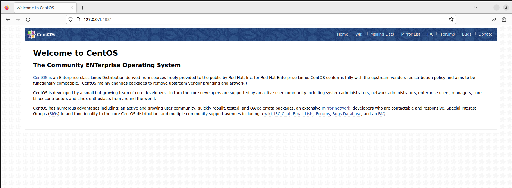

# Практика с SELinux

**Задание:**

* Запуск nginx на нестандартном порту 3-мя разными способами
    * переключатели setsebool;
    * добавление нестандартного порта в имеющийся тип;
    * формирование и установка модуля SELinux.

* Обеспечить работоспособность приложения при включенном selinux
    * развернуть приложенный стенд https://github.com/mbfx/otus-linux-adm/tree/master/selinux_dns_problems; 
    * выяснить причину неработоспособности механизма обновления зоны (см. README);
    * предложить решение (или решения) для данной проблемы;
    * выбрать одно из решений для реализации, предварительно обосновав выбор;
    * реализовать выбранное решение и продемонстрировать его работоспособность.

## Запуск nginx на нестандартном порту 3-мя разными способами

### Запуск Vagrantfile
После запуска `Vagrantfile` без изменений в консоль выводится следующая информация:
```bash
    selinux: Dependency Installed:
    selinux:   centos-indexhtml.noarch 0:7-9.el7.centos
    selinux:   centos-logos.noarch 0:70.0.6-3.el7.centos
    selinux:   gperftools-libs.x86_64 0:2.6.1-1.el7
    selinux:   nginx-filesystem.noarch 1:1.20.1-10.el7
    selinux:   openssl11-libs.x86_64 1:1.1.1k-5.el7
    selinux: 
    selinux: Complete!
    selinux: Job for nginx.service failed because the control process exited with error code. See "systemctl status nginx.service" and "journalctl -xe" for details.
    selinux: ● nginx.service - The nginx HTTP and reverse proxy server
    selinux:    Loaded: loaded (/usr/lib/systemd/system/nginx.service; disabled; vendor preset: disabled)
    selinux:    Active: failed (Result: exit-code) since Sun 2023-10-22 18:44:30 UTC; 15ms ago
    selinux:   Process: 2844 ExecStartPre=/usr/sbin/nginx -t (code=exited, status=1/FAILURE)
    selinux:   Process: 2843 ExecStartPre=/usr/bin/rm -f /run/nginx.pid (code=exited, status=0/SUCCESS)
    selinux: 
    selinux: Oct 22 18:44:30 selinux systemd[1]: Starting The nginx HTTP and reverse proxy server...
    selinux: Oct 22 18:44:30 selinux systemd[1]: nginx.service: control process exited, code=exited status=1
    selinux: Oct 22 18:44:30 selinux nginx[2844]: nginx: the configuration file /etc/nginx/nginx.conf syntax is ok
    selinux: Oct 22 18:44:30 selinux nginx[2844]: nginx: [emerg] bind() to 0.0.0.0:4881 failed (13: Permission denied)
    selinux: Oct 22 18:44:30 selinux nginx[2844]: nginx: configuration file /etc/nginx/nginx.conf test failed
    selinux: Oct 22 18:44:30 selinux systemd[1]: Failed to start The nginx HTTP and reverse proxy server.
    selinux: Oct 22 18:44:30 selinux systemd[1]: Unit nginx.service entered failed state.
    selinux: Oct 22 18:44:30 selinux systemd[1]: nginx.service failed.
The SSH command responded with a non-zero exit status. Vagrant
assumes that this means the command failed. The output for this command
should be in the log above. Please read the output to determine what
went wrong.
```

Сервис не был запущен. Далее проверим 3 способа решения данной проблемы, но перед этим убедимся, что конфигурация системы верная.

```bash

# Firewall is disabled
[vagrant@selinux ~]$ sudo systemctl status firewalld
● firewalld.service - firewalld - dynamic firewall daemon
   Loaded: loaded (/usr/lib/systemd/system/firewalld.service; disabled; vendor preset: enabled)
   Active: inactive (dead)
     Docs: man:firewalld(1)

# nginx conf is valid
[vagrant@selinux ~]$ sudo nginx -t
nginx: the configuration file /etc/nginx/nginx.conf syntax is ok
nginx: configuration file /etc/nginx/nginx.conf test is successful

# selinux is active
[vagrant@selinux ~]$ getenforce
Enforcing
```

### Переключатели setsebool

Найдем информацию об ошибке в `/var/log/audit/audit.log`:
```bash
[vagrant@selinux ~]$ sudo cat /var/log/audit/audit.log | audit2why
type=AVC msg=audit(1698008407.344:1019): avc:  denied  { name_bind } for  pid=22253 comm="nginx" src=4881 scontext=system_u:system_r:httpd_t:s0 tcontext=system_u:object_r:unreserved_port_t:s0 tclass=tcp_socket permissive=0

        Was caused by:
        The boolean nis_enabled was set incorrectly. 
        Description:
        Allow nis to enabled

        Allow access by executing:
        # setsebool -P nis_enabled 1
```
Как видим подсказку выше - можно использовать `setsebool -P nis_enabled 1`.

```bash
[vagrant@selinux ~]$ sudo setsebool -P nis_enabled 1
[vagrant@selinux ~]$ sudo systemctl start nginx
[vagrant@selinux ~]$ sudo systemctl status nginx
● nginx.service - The nginx HTTP and reverse proxy server
   Loaded: loaded (/usr/lib/systemd/system/nginx.service; disabled; vendor preset: disabled)
   Active: active (running) since Sun 2023-10-22 21:03:46 UTC; 6s ago
  Process: 22346 ExecStart=/usr/sbin/nginx (code=exited, status=0/SUCCESS)
  Process: 22342 ExecStartPre=/usr/sbin/nginx -t (code=exited, status=0/SUCCESS)
  Process: 22341 ExecStartPre=/usr/bin/rm -f /run/nginx.pid (code=exited, status=0/SUCCESS)
 Main PID: 22348 (nginx)
   CGroup: /system.slice/nginx.service
           ├─22348 nginx: master process /usr/sbin/nginx
           └─22350 nginx: worker process

Oct 22 21:03:46 selinux systemd[1]: Starting The nginx HTTP and reverse proxy server...
Oct 22 21:03:46 selinux nginx[22342]: nginx: the configuration file /etc/nginx/nginx.conf syntax is ok
Oct 22 21:03:46 selinux nginx[22342]: nginx: configuration file /etc/nginx/nginx.conf test is successful
Oct 22 21:03:46 selinux systemd[1]: Started The nginx HTTP and reverse proxy server.
```

Результат:


### Добавить нестандартный порт в имеющийся тип

Поиск имеющегося типа для http порта
```bash
[vagrant@selinux ~]$ sudo semanage port -l | grep http
http_cache_port_t              tcp      8080, 8118, 8123, 10001-10010
http_cache_port_t              udp      3130
http_port_t                    tcp      80, 81, 443, 488, 8008, 8009, 8443, 9000
pegasus_http_port_t            tcp      5988
pegasus_https_port_t           tcp      5989
```

Добавим порт в тип `http_port_t` и перезапустим nginx.
```bash
[vagrant@selinux ~]$ sudo semanage port -a -t http_port_t -p tcp 4881
[vagrant@selinux ~]$ sudo systemctl start nginx
[vagrant@selinux ~]$ sudo systemctl status nginx
● nginx.service - The nginx HTTP and reverse proxy server
   Loaded: loaded (/usr/lib/systemd/system/nginx.service; disabled; vendor preset: disabled)
   Active: active (running) since Sun 2023-10-22 21:09:35 UTC; 5s ago
  Process: 22411 ExecStart=/usr/sbin/nginx (code=exited, status=0/SUCCESS)
  Process: 22408 ExecStartPre=/usr/sbin/nginx -t (code=exited, status=0/SUCCESS)
  Process: 22407 ExecStartPre=/usr/bin/rm -f /run/nginx.pid (code=exited, status=0/SUCCESS)
 Main PID: 22413 (nginx)
   CGroup: /system.slice/nginx.service
           ├─22413 nginx: master process /usr/sbin/nginx
           └─22415 nginx: worker process

Oct 22 21:09:35 selinux systemd[1]: Starting The nginx HTTP and reverse proxy server...
Oct 22 21:09:35 selinux nginx[22408]: nginx: the configuration file /etc/nginx/nginx.conf syntax is ok
Oct 22 21:09:35 selinux nginx[22408]: nginx: configuration file /etc/nginx/nginx.conf test is successful
Oct 22 21:09:35 selinux systemd[1]: Started The nginx HTTP and reverse proxy server.
```

Вернем в предыдущее состояние:
```bash
[vagrant@selinux ~]$ sudo semanage port -d -t http_port_t -p tcp 4881
[vagrant@selinux ~]$ sudo systemctl stop nginx
[vagrant@selinux ~]$ sudo systemctl start nginx
Job for nginx.service failed because the control process exited with error code. See "systemctl status nginx.service" and "journalctl -xe" for details.
```

### Формирования и установка модуля SELinux

```bash
[vagrant@selinux ~]$ sudo grep nginx /var/log/audit/audit.log | audit2allow -M nginx
******************** IMPORTANT ***********************
To make this policy package active, execute:

semodule -i nginx.pp

[vagrant@selinux ~]$ ls
nginx.pp  nginx.te
```

Применим данный модуль и проверим работоспособность:
```bash
[vagrant@selinux ~]$ sudo semodule -i nginx.pp
[vagrant@selinux ~]$ sudo systemctl start nginx 
[vagrant@selinux ~]$ sudo systemctl status nginx 
● nginx.service - The nginx HTTP and reverse proxy server
   Loaded: loaded (/usr/lib/systemd/system/nginx.service; disabled; vendor preset: disabled)
   Active: active (running) since Sun 2023-10-22 21:14:53 UTC; 2s ago
  Process: 22484 ExecStart=/usr/sbin/nginx (code=exited, status=0/SUCCESS)
  Process: 22482 ExecStartPre=/usr/sbin/nginx -t (code=exited, status=0/SUCCESS)
  Process: 22481 ExecStartPre=/usr/bin/rm -f /run/nginx.pid (code=exited, status=0/SUCCESS)
 Main PID: 22486 (nginx)
   CGroup: /system.slice/nginx.service
           ├─22486 nginx: master process /usr/sbin/nginx
           └─22488 nginx: worker process

Oct 22 21:14:53 selinux systemd[1]: Starting The nginx HTTP and reverse proxy server...
Oct 22 21:14:53 selinux nginx[22482]: nginx: the configuration file /etc/nginx/nginx.conf syntax is ok
Oct 22 21:14:53 selinux nginx[22482]: nginx: configuration file /etc/nginx/nginx.conf test is successful
Oct 22 21:14:53 selinux systemd[1]: Started The nginx HTTP and reverse proxy server.
```

Отключим данный модуль и вернем систему в предыдущее состояние:
```bash
[vagrant@selinux ~]$ sudo semodule -l | grep nginx
nginx   1.0
[vagrant@selinux ~]$ sudo semodule -r nginx
libsemanage.semanage_direct_remove_key: Removing last nginx module (no other nginx module exists at another priority).
[vagrant@selinux ~]$ sudo semodule -l | grep nginx
[vagrant@selinux ~]$ sudo systemctl stop nginx
```

## Обеспечение работоспособности приложения при включенном SELinux

### Исправление стартовой конфигурации

Для начала внесем изменения в `Vagrantfile`, чтобы запустить `Ansible`, т.к. есть проблемы совместимости `Vagrant` и `Ansible 2.9.xx`.
Сделаем запуск `Vagrant` из provision shell скрипта:

Для `ns01`:

```bash
    ns01.vm.provision "shell", inline: <<-SHELL
      yum -y install epel-release
      yum -y install ansible.noarch
      cd /vagrant/provisioning
      ansible-playbook -i="ns01," -c local ./playbook.yml
    SHELL
```

И аналогичную секцию добавим для `client`.


### Проверка `nsupdate`

```bash
vagrant ssh client
# SSHed to `client` VM

[vagrant@client ~]$ nsupdate -k /etc/named.zonetransfer.key
> server 192.168.50.10
> zone ddns.lab
> update add www.ddns.lab. 60 A 192.168.50.15
> send
update failed: SERVFAIL
> quit
```

### Исследование LinuxSE логов

```bash
[vagrant@client ~]$ sudo cat /var/log/audit/audit.log | audit2why
[vagrant@client ~]$ 
```

Ошибок на `client` нет, перейдем на `ns01` через `vagrant ssh ns01`.

```bash
[vagrant@ns01 ~]$ sudo cat /var/log/audit/audit.log | audit2why 
type=AVC msg=audit(1697906510.004:1164): avc:  denied  { create } for  pid=4440 comm="isc-worker0000" name="named.ddns.lab.view1.jnl" scontext=system_u:system_r:named_t:s0 tcontext=system_u:object_r:etc_t:s0 tclass=file permissive=0

        Was caused by:
                Missing type enforcement (TE) allow rule.

                You can use audit2allow to generate a loadable module to allow this access.

[vagrant@ns01 ~]$
```


Проверим разрешения файлов в каталоге `/etc/named`:
```bash
[vagrant@ns01 ~]$ sudo ls -laZ  /etc/named
drw-rwx---. root named system_u:object_r:etc_t:s0       .
drwxr-xr-x. root root  system_u:object_r:etc_t:s0       ..
drw-rwx---. root named unconfined_u:object_r:etc_t:s0   dynamic
-rw-rw----. root named system_u:object_r:etc_t:s0       named.50.168.192.rev
-rw-rw----. root named system_u:object_r:etc_t:s0       named.dns.lab
-rw-rw----. root named system_u:object_r:etc_t:s0       named.dns.lab.view1
-rw-rw----. root named system_u:object_r:etc_t:s0       named.newdns.lab
[vagrant@ns01 ~]$ 
```

Видно, что файлы имеют неправильный контекст: `etc_t` вместо `named_t`. Данную проблему можно исправить с помощью `chcon`.

### Изменение разрешений файлов и проверка

```bash
[vagrant@ns01 ~]$ sudo chcon -R -t named_zone_t /etc/named
[vagrant@ns01 ~]$ sudo ls -laZ  /etc/named
drw-rwx---. root named system_u:object_r:named_zone_t:s0 .
drwxr-xr-x. root root  system_u:object_r:etc_t:s0       ..
drw-rwx---. root named unconfined_u:object_r:named_zone_t:s0 dynamic
-rw-rw----. root named system_u:object_r:named_zone_t:s0 named.50.168.192.rev
-rw-rw----. root named system_u:object_r:named_zone_t:s0 named.dns.lab
-rw-rw----. root named system_u:object_r:named_zone_t:s0 named.dns.lab.view1
-rw-rw----. root named system_u:object_r:named_zone_t:s0 named.newdns.lab
```

Попытаемся снова с `client` внести изменения в зону:
```bash
[vagrant@client ~]$ nsupdate -k /etc/named.zonetransfer.key
> server 192.168.50.10
> zone ddns.lab
> update add www.ddns.lab 60 A 192.168.50.15
> send
> quit
[vagrant@client ~]$ 
```

Проверим изменения:
```bash
[vagrant@client ~]$ dig www.ddns.lab

; <<>> DiG 9.11.4-P2-RedHat-9.11.4-26.P2.el7_9.15 <<>> www.ddns.lab
;; global options: +cmd
;; Got answer:
;; ->>HEADER<<- opcode: QUERY, status: NOERROR, id: 23735
;; flags: qr aa rd ra; QUERY: 1, ANSWER: 1, AUTHORITY: 1, ADDITIONAL: 2

;; OPT PSEUDOSECTION:
; EDNS: version: 0, flags:; udp: 4096
;; QUESTION SECTION:
;www.ddns.lab.                  IN      A

;; ANSWER SECTION:
www.ddns.lab.           60      IN      A       192.168.50.15

;; AUTHORITY SECTION:
ddns.lab.               3600    IN      NS      ns01.dns.lab.

;; ADDITIONAL SECTION:
ns01.dns.lab.           3600    IN      A       192.168.50.10

;; Query time: 0 msec
;; SERVER: 192.168.50.10#53(192.168.50.10)
;; WHEN: Sat Oct 21 17:33:23 UTC 2023
;; MSG SIZE  rcvd: 96
```

Проверим изменения после перезагрузки хостов:
```bash
[vagrant@client ~]$ dig @192.168.50.10 www.ddns.lab

; <<>> DiG 9.11.4-P2-RedHat-9.11.4-26.P2.el7_9.15 <<>> @192.168.50.10 www.ddns.lab
; (1 server found)
;; global options: +cmd
;; Got answer:
;; ->>HEADER<<- opcode: QUERY, status: NOERROR, id: 51931
;; flags: qr aa rd ra; QUERY: 1, ANSWER: 1, AUTHORITY: 1, ADDITIONAL: 2

;; OPT PSEUDOSECTION:
; EDNS: version: 0, flags:; udp: 4096
;; QUESTION SECTION:
;www.ddns.lab.                  IN      A

;; ANSWER SECTION:
www.ddns.lab.           60      IN      A       192.168.50.15

;; AUTHORITY SECTION:
ddns.lab.               3600    IN      NS      ns01.dns.lab.

;; ADDITIONAL SECTION:
ns01.dns.lab.           3600    IN      A       192.168.50.10

;; Query time: 1 msec
;; SERVER: 192.168.50.10#53(192.168.50.10)
;; WHEN: Sun Oct 22 18:38:56 UTC 2023
;; MSG SIZE  rcvd: 96
```

Запись была успешно добавлена и сохранилась после перезагрузки.

### Возврат состояния файлов
```
[vagrant@ns01 ~]$ sudo restorecon -v -R /etc/named
restorecon reset /etc/named context system_u:object_r:named_zone_t:s0->system_u:object_r:etc_t:s0
restorecon reset /etc/named/named.dns.lab context system_u:object_r:named_zone_t:s0->system_u:object_r:etc_t:s0
restorecon reset /etc/named/named.dns.lab.view1 context system_u:object_r:named_zone_t:s0->system_u:object_r:etc_t:s0
restorecon reset /etc/named/dynamic context unconfined_u:object_r:named_zone_t:s0->unconfined_u:object_r:etc_t:s0
restorecon reset /etc/named/dynamic/named.ddns.lab context system_u:object_r:named_zone_t:s0->system_u:object_r:etc_t:s0
restorecon reset /etc/named/dynamic/named.ddns.lab.view1 context system_u:object_r:named_zone_t:s0->system_u:object_r:etc_t:s0
restorecon reset /etc/named/dynamic/named.ddns.lab.view1.jnl context system_u:object_r:named_zone_t:s0->system_u:object_r:etc_t:s0
restorecon reset /etc/named/named.newdns.lab context system_u:object_r:named_zone_t:s0->system_u:object_r:etc_t:s0
restorecon reset /etc/named/named.50.168.192.rev context system_u:object_r:named_zone_t:s0->system_u:object_r:etc_t:s0
```

