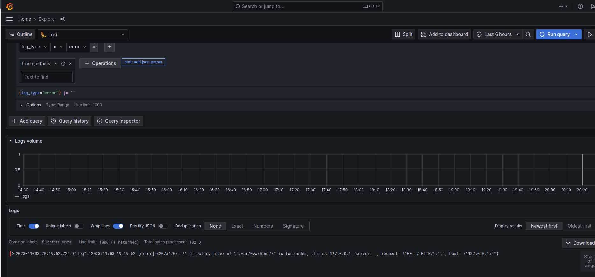
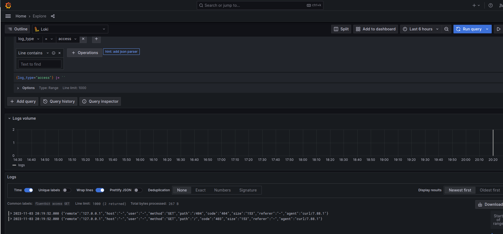

# Настройка центрального сервера для сбора логов

### Задание

1. Поднять 2 машины:
  * web с nginx 
  * log как сервер сбора логов (rsyslog)
2. Настроить аудит за изменением конфигов nginx:
  * Логи с уровнем critical должны собираться локально и удаленно
  * Все логи должны собираться на удаленном сервере
  * Логи аудита также должны собираться на удаленной системе
3. (*) Настроить ELK

Вместо ELK я выбрал Fluent-Bit - Loki - Grafana

### Конфигурация инфраструктуры

Сконфигурируем 3 машины:
* web (192.168.67.10)
* log (192.168.67.15)
* loki (192.168.67.20)


В качестве основной ОС будет использоваться Debian 12 (bookworm).
Provision блок в Vagrant выглядит следующим образом:

```ruby
box.vm.provision "shell", inline: <<-SHELL
  sed -i 's/^# *\(en_US.UTF-8\)/\1/' /etc/locale.gen
  locale-gen    
  apt-get update
  apt-get install ansible -y  

  cd /vagrant/provisioning
  ansible-playbook -i="#{boxname}," -c local ./playbook.yml
SHELL
```

Т.е. Ansible вызывается локально на каждой машине.

Далее буду приведены Ansible блоки с настройками.

### Chrony

Для использования единой tz на машинах скопируем в качестве основной tz `Europe/Moscow`.

```yaml
  tasks:
  - name: TZ | Copy Moscow tz
    copy: src=/usr/share/zoneinfo/Europe/Moscow dest=/etc/localtime
  - name: TZ | Restart chrony
    systemd:
      name: chronyd
      state: restarted
```

### Настройка web хоста

На данном хосте больше всего изменений будет произведено.
Для начала установим следующие пакеты:
- nginx
- auditd
- audispd-plugins
- curl 
- gpg

Добавлены в `/etc/audit/rules.d/audit.rules` следующие строки для аудитом изменения nginx файлов [link](./provisioning/files/web/audit.rules):
```
-w /etc/nginx/nginx.conf -p wa -k nginx_conf
-w /etc/nginx/default.d/ -p wa -k nginx_conf
```

Изменения в `/etc/audit/auditd.conf` [link](./provisioning/files/web/auditd.conf):
```bash
log_format = RAW
name_format = HOSTNAME
```

Изменения `/etc/audit/plugins.d/au-remote.conf` [link](./provisioning/files/web/au-remote.conf):
```
active = yes
```

Изменения `/etc/audit/audisp-remote.conf`. Для этого файла использован ansible шаблон [link](./provisioning/files/web/templates/audisp-remote.conf.j2):
```
remote_server = {{ log_host }}
...
```

Шаблон для `/etc/nginx/nginx.conf` [link](./provisioning/files/web/templates/nginx.conf.j2):
```bash
error_log /var/log/nginx/error.log;
error_log syslog:server={{ log_host }}:514,tag=nginx_error;
...
http {
	access_log /var/log/nginx/access.log;
	access_log syslog:server={{ log_host }}:514,tag=access_log,severity=info combined;
...
}
```

Чтобы "сломать" nginx, можно переместить html страницу:
```bash
mv /var/www/html/index.nginx-debian.html /var/www/html/__index.nginx-debian.html
```

После можно перезапустить: `nginx`, `auditd`.

### Настройка log хоста
Для начала установим следующие пакеты:
- auditd


Часть файла `/etc/rsyslog.conf` с изменениями [link](./provisioning/files/log/rsyslog.conf):
```
# provides UDP syslog reception
module(load="imudp")
input(type="imudp" port="514")

# provides TCP syslog reception
module(load="imtcp")
input(type="imtcp" port="514")

...
$template RemoteLogs,"/var/log/rsyslog/%HOSTNAME%/%PROGRAMNAME%.log"
*.* ?RemoteLogs
& ~
```

Часть настроек audit `/etc/audit/auditd.conf` [link](./provisioning/files/log/auditd.conf):
```
tcp_listen_port = 60
```

Теперь необходимо перезагрузить `auditd`, `rsyslog`.

### Настройка loki(grafana + loki) и web(fluent-bit)

##### Настройка web хоста 

Порядок настройки fluent-bit
* Добавить apt репозиторий для fluent-bit
* Установить fluent-bit
* Сконфигурировать обработку логов
* Добавить unit файл
* Запустить сервис

Из всего вышеуказанно стоит обратить внимание на `/etc/fluent-bit/conf.yaml` [link](./provisioning/files/web/templates/fluent-bit.yaml.j2):
```yaml
service:
  parsers_file: parsers.conf
  plugins_file: plugins.conf
pipeline:
  inputs:
    - name: tail
      path: /var/log/nginx/access.log
      tag: access_log
      parser: nginx
    - name: tail
      path: /var/log/nginx/error.log
      tag: error_log
  outputs:
    - name: loki
      host: {{ loki_host }}
      match: error_log
      labels: job=fluentbit,log_type=error
    - name: loki
      host: {{ loki_host }}
      match: access_log
      labels: job=fluentbit,log_type=access
      label_keys: $code,$method,$path
```
В данном файле настраивается слежение за `/var/log/nginx/access.log` и `/var/log/nginx/error.log`.

Для `access` файла используется встроенный парсер `nginx`.
Логи из этих файлов имеют разные лейблы:`log_type=access` и `log_type=error`.

Запускается `fluent-bit` в `unit` файле следующим образом [link](./provisioning/files/web/fluent-bit.service) : `/opt/fluent-bit/bin/fluent-bit -c /etc/fluent-bit/conf.yaml`.

##### Настройка loki хоста

Порядок настройки следующий:
* Добавление `grafana` `apt` репозитория
* Установка `loki` и `grafana`
* Создание unit файла для `loki`
* Добавление `loki` datasource для `grafana`
* Запуск сервисов
* Изменение пароля для `grafana` на `12345678` 

`Datasource` указывается следующим образом [link](./provisioning/files/loki/datasource.yaml):
```yaml
apiVersion: 1

datasources:
  - name: Loki
    type: loki
    access: proxy
    url: http://localhost:3100

```

`Loki` запускается в `unit` файле следующим образом [link](./provisioning/files/loki/loki.service):
```bash
loki --config.file  /etc/loki/config.yaml
```

### Проверка

Зайдем на `web` хост и сделаем следующее:
```
curl 127.0.0.1
curl 127.0.0.1/404
sudo sed -i 's/768/767/g' /etc/nginx/nginx.conf
```

Зайдем на `log` хост и проверим:

**audit logs**
```bash

root@log:~# cat /var/log/audit/audit.log | grep nginx_conf

node=web type=CONFIG_CHANGE msg=audit(1699024918.470:27): auid=4294967295 ses=4294967295 subj=unconfined op=add_rule key="nginx_conf" list=4 res=1
node=web type=CONFIG_CHANGE msg=audit(1699024918.470:28): auid=4294967295 ses=4294967295 subj=unconfined op=add_rule key="nginx_conf" list=4 res=1
node=web type=SYSCALL msg=audit(1699028392.745:104): arch=c000003e syscall=82 success=yes exit=0 a0=556740442c30 a1=7fff18d1e70f a2=556216302a12 a3=7f95875d3508 items=5 ppid=5517 pid=5518 auid=1000 uid=0 gid=0 euid=0 suid=0 fsuid=0 egid=0 sgid=0 fsgid=0 tty=pts2 ses=5 comm="sed" exe="/usr/bin/sed" subj=unconfined key="nginx_conf"
```
Изменения были замечены.


**nginx access logs**
```bash
root@log:~# cat /var/log/rsyslog/web/access_log.log 
2023-11-03T19:19:52+03:00 web access_log: 127.0.0.1 - - [03/Nov/2023:19:19:52 +0300] "GET / HTTP/1.1" 403 153 "-" "curl/7.88.1"
2023-11-03T19:19:52+03:00 web access_log: 127.0.0.1 - - [03/Nov/2023:19:19:52 +0300] "GET /404 HTTP/1.1" 404 153 "-" "curl/7.88.1"
```

**nginx error logs**
```
root@log:~# cat /var/log/rsyslog/web/nginx_error.log 
2023-11-03T19:19:52+03:00 web nginx_error: 2023/11/03 19:19:52 [error] 4207#4207: *1 directory index of "/var/www/html/" is forbidden, client: 127.0.0.1, server: _, request: "GET / HTTP/1.1", host: "127.0.0.1"
```

Зайдем в графана и выведем логи для `log_type=error` и `log_type=access`:




