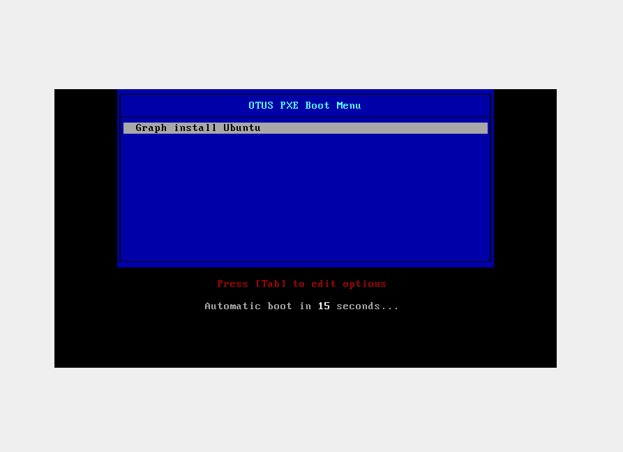

# DHCP, TFTP, PXE

1. Установить и настроить загрузку по сети для дистрибутива
2. Установка из репозитория HTTP.
3. Настроить автоматическую установку для созданного kickstart файла (*) Файл загружается по HTTP.

### Изменения 

В качестве дистрибутива был выбран образ Ubuntu 22.04.
Ubuntu имеет свои особенности установки через PXE:
* необходимо указывать HTTP URL до iso образа дистрибутива
* из-за того, что будет использоваться образ дистрибутива, хост, на который будет производится установка, должен иметь достаточное кол-во памяти для скачивания и развертывания данного образа
* вместо `kickstart` файла используется своя система автоматической установки
    * P.S. я честно пытался через kickstart файл сделать, но ковыряться в параметрах ядра в поиске полузадокументированных возможностей - не самое приятное занятие.
    * P.P.S также я пытался обойти использование iso образа - с ходу не получилось, поэтому я открыл документацию Ubuntu и сделал по образу и подобию.

**NOTE:** перед запуском vagrant файла необходимо скачать в директорию `files/` образ ubuntu 22.04 под именем `ubuntu-2204-server.iso` [link](https://releases.ubuntu.com/jammy/ubuntu-22.04.3-live-server-amd64.iso)

### Vagrantfile

Данный файл содержит 2 конфигурации:
**pxe сервер**

```ruby
    config.vm.define "pxeserver" do |server|
      server.vm.box = "ubuntu/mantic64"
    
      server.vm.host_name = 'pxeserver'
      server.vm.network :private_network, ip: "192.168.56.1", virtualbox__intnet: 'pxenet'
      server.vm.network "forwarded_port", guest: 80, host: 18080
      server.vm.provider "virtualbox" do |vb|
        vb.memory = "2048"
        vb.customize ["modifyvm", :id, "--natdnshostresolver1", "on"]
      end

      server.vm.provision "shell", inline: <<-SHELL
        apt-get update
        apt-get install ansible -y  

        cd /vagrant
        ansible-playbook -i="pxeserver," -c local ./playbook.yml
      SHELL
    end
```

В качестве базового образа используется `ubuntu`. В качестве `provisioning` испольуется `ansible playbook`.

**pxe клиент**
```ruby
config.vm.define "pxeclient" do |pxeclient|
    pxeclient.vm.box = 'ubuntu/mantic64'
    pxeclient.vm.host_name = 'pxeclient'
    pxeclient.vm.network :private_network, ip: "192.168.56.100", virtualbox__intnet: 'pxenet'
    pxeclient.vm.provider :virtualbox do |vb|
    vb.memory = "6144"
    vb.customize ["modifyvm", :id, "--natdnshostresolver1", "on"]
    vb.customize [
        'modifyvm', :id,
        '--nic1', 'intnet',
        '--intnet1', 'pxenet',
        '--nic2', 'nat',jrt
        '--boot1', 'net',
        '--boot2', 'none',
        '--boot3', 'none',
        '--boot4', 'none'
        ]
    vb.customize ["modifyvm", :id, "--natdnshostresolver1", "on"]
    end
end
```
В качетве базового образа используется `ubuntu`, но только для базовой конфигурации "железа", которое эмулирует `virtualbox`. Также изменен порядок загрузки, сначала будет производиться загрузка по сети.

### Конфигурация PXE сервера

###### Установка и конфигурация apache2

* Установить пакет `apache2`
* Создать папку `/iso` и сделать ее доступной по HTTP
* Положить в `/iso` папку файл для автоматической установки (данный файл был получен после ручной установки, он автоматически генерируется в `/var/log/install/autoinstall-user-data`)

**Конфигурация `apache2`**
```bash
Alias /ubuntu2204 /iso
#Указываем адрес директории /iso
<Directory /iso>
    Options Indexes FollowSymLinks
    #Разрешаем подключения со всех ip-адресов
    Require all granted
</Directory>
```

**Часть файла автоматической установки**
```yaml
autoinstall:
  apt:
    disable_components: []
    fallback: abort
    geoip: true
    mirror-selection:
      primary:
      - country-mirror
      - arches:
        - amd64
        - i386
        uri: http://archive.ubuntu.com/ubuntu
      - arches:
        - s390x
        - arm64
        - armhf
        - powerpc
        - ppc64el
        - riscv64
        uri: http://ports.ubuntu.com/ubuntu-ports
    preserve_sources_list: false
  codecs:
    install: false
```

**Часть `playbook.yaml`**
```yaml
- hosts: all
  tasks:
  - name: mkdir for serving files via http 
    file:
      path: /iso
      state: directory
      mode: 0755
  - name: copy image and autoinstall config
    copy:
      src: /vagrant/files/ubuntu-2204-server.iso
      dest: /iso/ubuntu.iso
      mode: 0644
  - name: copy autoinstall config
    copy:
      src: /vagrant/files/user-data
      dest: /iso/user-data
      mode: 0644
  - name: install apache2
    apt:
      name: apache2
      state: present
      update_cache: yes
  - name: copy apache config
    copy:
      src: /vagrant/files/apache2.conf
      dest: /etc/apache2/sites-available/apache2.conf
      mode: 0644
  - name: restart apache2
    service:
      name: apache2
      enabled: yes
      state: restarted
```


###### Установка и настройка dhcp

* Устанавливаем `dhcp` пакет
* Копируем конфигурацию `dhcp`

**Конфигурация `dhcp`, там же указан сервер, который является базовым для PXE загрузки:**

```bash
option space pxelinux;
option pxelinux.magic code 208 = string;
option pxelinux.configfile code 209 = text;
option pxelinux.pathprefix code 210 = text;
option pxelinux.reboottime code 211 = unsigned integer 32;
option architecture-type code 93 = unsigned integer 16;

#Указываем сеть и маску подсети, в которой будет работать DHCP-сервер
subnet 192.168.56.0 netmask 255.255.248.0 {
        range 192.168.56.100 192.168.56.120;

        class "pxeclients" {
          match if substring (option vendor-class-identifier, 0, 9) = "PXEClient";
          next-server 192.168.56.1;
          filename "pxelinux.0";
        }
}
```

**Часть `playbook.yaml`:**

```yaml
# install and configure dhcp
- hosts: all
  tasks:
  - name: install packages (isc-dhcp-server)
    apt:
      name: isc-dhcp-server
      state: present
      update_cache: yes
  - name: copy dhcp config
    copy:
      src: /vagrant/files/dhcpd.conf
      dest: /etc/dhcp/dhcpd.conf
      mode: 0644
  - name: restart dhcp
    service:
      name: isc-dhcp-server
      enabled: yes
      state: restarted

```

###### Установка `tftp` и подготовка файлов для загрузки ОС через PXE

* Установить tftp
* Установить syslinux, pxelinux
* Скопировать необходимые syslinux/pxelinux файлы в папку tftp
* Извлечь из iso образа initrd и vmlinuz и положить в папке tftp
* Скопировать конфигурационный файл для pxelinux загрузчика


Файл конфигурации загрузчика
```
default menu.c32
prompt 0
#Время счётчика с обратным отсчётом (установлено 15 секунд)
timeout 150
#Параметр использования локального времени
ONTIME local
#Имя «шапки» нашего меню
menu title OTUS PXE Boot Menu
       #Описание первой строки
       label 1
       #Имя, отображаемое в первой строке
       menu label ^ Graph install Ubuntu
       #Адрес ядра, расположенного на TFTP-сервере
       kernel /vmlinuz
       #Адрес файла initrd, расположенного на TFTP-сервере
       initrd /initrd
       #Получаем адрес по DHCP и указываем адрес веб-сервера
       append ip=:::::enp0s3:dhcp root=/dev/ram0 ramdisk_size=3000000  url=http://192.168.56.1/ubuntu2204/server.iso autoinstall cloud-config-url=http://192.168.56.1/ubuntu2204/autoinstall/user-data  ds=nocloud-net s=http://192.168.56.1/ubuntu2204/autoinstall/
```

Разберем подробнее параметры в `append`:
* `ip=:::::enp0s3:dhcp` - настройка IP адреса на интерфейсе `enp0s3` через `dhcp`. Двоеточия нужны для пропуска остальных позиционных параметров [link](https://access.redhat.com/documentation/ru-ru/red_hat_enterprise_linux/7/html/networking_guide/sec-configuring_ip_networking_from_the_kernel_command_line)
* `autoinstall cloud-config-url=http://192.168.56.1/ubuntu2204/autoinstall/user-data  ds=nocloud-net s=http://192.168.56.1/ubuntu2204/autoinstall/` - эти параметры необходимы для указания, что будет использовать автоматический установщик
* `root=/dev/ram0 ramdisk_size=3000000  url=http://192.168.56.1/ubuntu2204/server.iso` - указывается URL для iso образа, а также конфигурируется файловая система, чтобы iso образ мог быть загружен локально, т.к. он занимает ~ 2 ГБ.


**playbook.yaml**:

```yaml
# install tftp and copy files needed for PXE boot
- hosts: all
  tasks:
  - name: install packages (tftpd-hpa)
    apt:
      pkg:
        - tftpd-hpa 
        - pxelinux
        - syslinux
      state: latest
      update_cache: true
  - name: Copy syslinux modules
    copy: 
      src: "/usr/lib/syslinux/modules/bios/{{ item.name }}" 
      dest: "/srv/tftp/{{ item.name }}"
      owner: root
      group: root
      mode: 0644
    loop:
      - name: ldlinux.c32
      - name: libmenu.c32
      - name: libutil.c32
      - name: menu.c32
      - name: vesamenu.c32
  - name: Copy pxelinux module
    copy:
      src: /usr/lib/PXELINUX/pxelinux.0
      dest: /srv/tftp/pxelinux.0
      owner: root
      group: root
      mode: 0644
  - name: mount iso
    mount:
      path: /mnt
      src: /iso/server.iso
      fstype: iso9660
      opts: loop
      state: mounted
  - name: Copy kernel and initrd
    copy: 
      src: "/mnt/casper/{{ item.name }}" 
      dest: "/srv/tftp/{{ item.name }}"
      owner: root
      group: root
      mode: 0644
    loop:
      - name: vmlinuz
      - name: initrd
  - name: Create folder for PXE config
    file:
      path: /srv/tftp/pxelinux.cfg
      state: directory
      mode: 0755
  - name: Copy PXE config
    copy:
      src: /vagrant/files/pxelinux.cfg
      dest: /srv/tftp/pxelinux.cfg/default
      owner: root
      group: root
      mode: 0644
```


### Проверка

1) Для начала запустим pxeserver: `vagrant up pxeserver`

2) Проверим, что файлы доступны через apache2:


3) Запустим `pxeclient` `vagrant up pxeclient` и откроем `virtualbox` и сделаем несколько скриншотов:

* Загрузка через PXE:



* Скачивание образа `ubuntu` с `pxeserver`:


* Автоматическая установка:


4) Загрузка ОС после установки (хост и имя пользователя):


