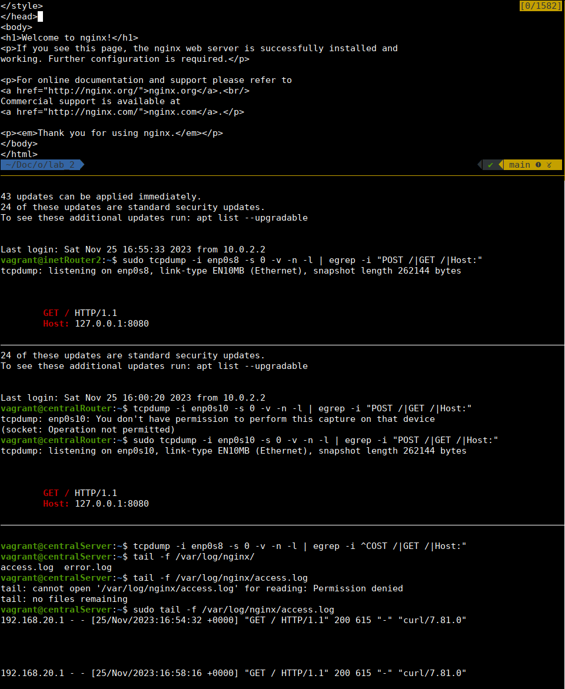

# Iptables

### Задание 

* реализовать knocking port
  * centralRouter может попасть на ssh inetRouter через knock скрипт
* добавить inetRouter2, который виден(маршрутизируется (host-only тип сети для виртуалки)) с хоста или форвардится порт через локалхост.
  * запустить nginx на centralServer.
  * пробросить 80й порт на inetRouter2:8080.
  * маршрут по умолчанию в интернет оставить через inetRouter.

### Инфраструктура

Будет реализована следующая структура сети (по образу и подобию из лаборатной работы про маршрутизацию):


`netplan` конфигурации находятся [здесь](https://github.com/0rps/otus-linux-adm/tree/main/lab_20_knock/files) 

Также для `inetRouter` будет настроено `NAT` правило для iptables:
```
*nat
-A POSTROUTING ! -d 192.168.0.0/16 -o enp0s3 -j MASQUERADE
```

Также для `inetRouter2` будет проброшен порт 8080 на хост машину.
`inetRouter` будет служить точкой по-умолчанию для трафика в интернет.

[Ansible playbook](https://github.com/0rps/otus-linux-adm/blob/main/lab_20_knock/playbook.yml)

### Настройка маршрутизации пакетов через inetRouter2 к centralServer

1. Проброс портов с хостовой машины: `8080` -> `inetRouter:8080`
2. Настройка iptables для маршрутизации пакетов на машину `centralServer` и порт 80
```bash
# IP_ADDR_TPL заменяется через sed на IP для интерфейса enp0s3
-A PREROUTING -d IP_ADDR_TPL/24 -i enp0s3 -p tcp -m tcp --dport 8080 -j DNAT --to-destination 192.168.100.2:80
-A POSTROUTING -o enp0s8 -p tcp -j SNAT --to-source 192.168.20.1
```
3. На `centralServer` устанавливается `nginx`


**Проверка**
Четыре терминала:
* хост (curl)
* inetRouter (tcpdump)
* centralRouter (tcpdump)
* centraServer (tail -f access.log)

Можем увидеть, что запрос прошел через все машины.




### Настройка knocking port на centralRouter
Настройка iptables для `inetRouter`:
```bash
*filter
# Перенаправить трафик с enp0s8 в TRAFFIC цепочку
-A INPUT -i enp0s8 -j TRAFFIC
-A TRAFFIC -p icmp --icmp-type any -j ACCEPT
-A TRAFFIC -m state --state ESTABLISHED,RELATED -j ACCEPT

# Проверить есть ли ip в SSH1, если есть, то принять пакет
-A TRAFFIC -m state --state NEW -m tcp -p tcp --dport 22 -m recent --rcheck --seconds 30 --name SSH1 -j ACCEPT

# Удалить ip из SSh1
-A TRAFFIC -m state --state NEW -m tcp -p tcp -m recent --name SSH1 --remove -j DROP
# # Проверить есть ли ip в SSH0, если есть, то добавить в SSH1
-A TRAFFIC -m state --state NEW -m tcp -p tcp --dport 9022 -m recent --rcheck --name SSH0 -j SSH1-ADD
-A SSH1-ADD -m recent --name SSH1 --set -j DROP

# Удалить IP из SSH0
-A TRAFFIC -m state --state NEW -m tcp -p tcp -m recent --name SSH0 --remove -j DROP
# Если клиент пришел на порт 8022, то добавить IP в SSH0
-A TRAFFIC -m state --state NEW -m tcp -p tcp --dport 8022 -m recent --name SSH0 --set -j DROP

# Дропнуть остальной трафик
-A TRAFFIC -j DROP
COMMIT
```

**Проверка**
```bash
# неуспешная попытка
root@centralRouter:~# ssh -i /root/.ssh/knock 192.168.10.1
ssh: connect to host 192.168.10.1 port 22: Connection timed out

# port knocking
root@centralRouter:~# nmap -Pn --host-timeout 201 --max-retries 0  -p 8022 192.168.10.1 > /dev/null
root@centralRouter:~# nmap -Pn --host-timeout 201 --max-retries 0  -p 9022 192.168.10.1 > /dev/null
root@centralRouter:~# ssh -i /root/.ssh/knock 192.168.10.1
The authenticity of host '192.168.10.1 (192.168.10.1)' can't be established.
ED25519 key fingerprint is SHA256:B6V/uakYwWniFRAs6ZzEcAKGanJyJPf/laa/3E+zy0E.
This key is not known by any other names.
Are you sure you want to continue connecting (yes/no/[fingerprint])? yes
Warning: Permanently added '192.168.10.1' (ED25519) to the list of known hosts.
Welcome to Ubuntu 23.10 (GNU/Linux 6.5.0-9-generic x86_64)
```


