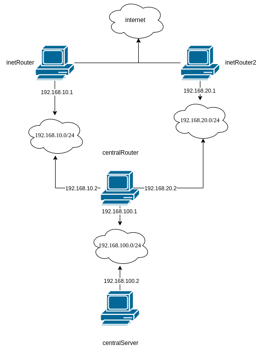

# Iptables

### Задание 

* реализовать knocking port
  * centralRouter может попасть на ssh inetRouter через knock скрипт
* добавить inetRouter2, который виден(маршрутизируется (host-only тип сети для виртуалки)) с хоста или форвардится порт через локалхост.
  * запустить nginx на centralServer.
  * пробросить 80й порт на inetRouter2:8080.
  * маршрут по умолчанию в интернет оставить через inetRouter.

### Инфраструктура

Будет реализована следующая структура сети:

Также для `inetRouter2` будет проброшен порт 8080 на хост машину.

### Настройка маршрутизации пакетов через inetRouter2 к centralServer

1. Для начала 

### Проверка маршрутизации пакетов

### Настройка knocking port на centralRouter

### Проверка knocking port 
