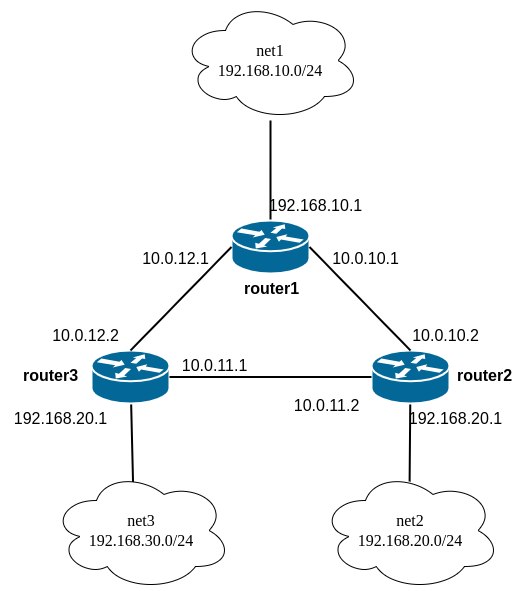

# Статическая и динамическая маршрутизация OSPF

### Задание

Объединить их разными vlan
- настроить OSPF между машинами на базе Quagga;
- изобразить ассиметричный роутинг;
- сделать один из линков "дорогим", но что бы при этом роутинг был симметричным.

### Инфраструктура

В данной работе будут использованы 3 виртуальные машины. Топология сети будет выглядеть следующим образом:


В качестве базового образа используется `Ubuntu 23.10`.
В качестве provisioning выступает следующий скрипт, который запускает ansible на каждой виртуальной машине.

```bash
      box.vm.provision "shell", inline: <<-SHELL
          apt-get update
          apt-get install ansible -y  

          cd /vagrant/files
          ansible-playbook -i="#{box_name}," -c local ./playbook.yml
      SHELL
```

### Настройка OSPF

Настройка происходит через ansible: [ansible](./files/playbook.yml).
Главным файлом для OSPF является `frr.conf`:
```bash

frr version 8.1
frr defaults traditional
!Указываем имя машины
hostname {{ ansible_hostname }}
log syslog informational
no ipv6 forwarding
service integrated-vtysh-config
interface enp0s8
 description {{ ospf['if']['s8']['description'] }}
 ip address {{ ospf['if']['s8']['address'] }}
 ip ospf mtu-ignore

 ip ospf cost 1000

 ip ospf cost 1000

 !ip ospf cost 450

 ip ospf hello-interval 10
 ip ospf dead-interval 30
interface enp0s9
 description {{ ospf['if']['s9']['description'] }}
 ip address {{ ospf['if']['s9']['address'] }}
 ip ospf mtu-ignore
 !ip ospf cost 45
 ip ospf hello-interval 10
 ip ospf dead-interval 30
interface enp0s10
 description {{ ospf['if']['s10']['description'] }}
 ip address {{ ospf['if']['s10']['address'] }}
 ip ospf mtu-ignore
 !ip ospf cost 45
 ip ospf hello-interval 10
 ip ospf dead-interval 30 
router ospf
 router-id {{ ospf['rid'] }}
 network {{ ospf['if']['s8']['subnet'] }} area {{ ospf['area'] }}
 network {{ ospf['if']['s9']['subnet'] }} area {{ ospf['area'] }}
 network {{ ospf['if']['s10']['subnet'] }} area {{ ospf['area'] }}
 neighbor {{ ospf['if']['s8']['neighbor'] }}
 neighbor {{ ospf['if']['s9']['neighbor'] }}

log file /var/log/frr/frr.log
default-information originate always
```

Машины имеют одинаковую топология, поэтому этот файл был шаблонизирован и для каждой машины используется свой набор переменных, например, для router2:
```yaml
---
ospf:
  rid: 2.2.2.2
  area: '0'
  if:
    s8:
      description: r2-r1
      address: 10.0.10.2/30
      subnet: 10.0.10.0/30
      neighbor: 10.0.10.1
    s9:
      description: r2-r3
      address: 10.0.11.2/30
      subnet: 10.0.11.0/30
      neighbor: 10.0.11.1
    s10:
      description: net_router2
      address: 192.168.20.1/24
      subnet: 192.168.20.0/24
```

### Проверка ассиметричного роутинга
Данный роутинг является роутингом по-умолчанию после запуска виртуальных машин.
Проверка заключается в том, что `router1` будет отправлять `ping` через интерфейс с `ip: 192.168.10.1` на интерфейс `router2` с `ip:192.168.20.1`.

Ассиметричность трафика будет в том, что ping будет уходить через enp0s9, а приходить через enp0s8.

Запуск `ping` на `router1`
```bash
root@router1:/var/log/frr# ping -i 3 -I 192.168.10.1 192.168.20.1
PING 192.168.20.1 (192.168.20.1) from 192.168.10.1 : 56(84) bytes of data.
64 bytes from 192.168.20.1: icmp_seq=1 ttl=64 time=1.87 ms
64 bytes from 192.168.20.1: icmp_seq=2 ttl=64 time=2.20 ms
64 bytes from 192.168.20.1: icmp_seq=3 ttl=64 time=2.26 ms
```

Запуск `tcpdump` на `router2:enp0s9` (для приема icmp запросов):
```bash
root@router2:/vagrant/files# tcpdump -i enp0s9 icmp
tcpdump: verbose output suppressed, use -v[v]... for full protocol decode
listening on enp0s9, link-type EN10MB (Ethernet), snapshot length 262144 bytes
14:59:28.873702 IP 192.168.10.1 > router2: ICMP echo request, id 41756, seq 33, length 64
14:59:31.912988 IP 192.168.10.1 > router2: ICMP echo request, id 41756, seq 34, length 64
14:59:34.961176 IP 192.168.10.1 > router2: ICMP echo request, id 41756, seq 35, length 64
```

Запуск `tcpdump` на `router2:enp0s8` (для отправки icmp ответов):
```bash
root@router2:/vagrant/files# tcpdump -i enp0s8 icmp
tcpdump: verbose output suppressed, use -v[v]... for full protocol decode
listening on enp0s8, link-type EN10MB (Ethernet), snapshot length 262144 bytes
15:00:05.580326 IP router2 > 192.168.10.1: ICMP echo reply, id 41756, seq 45, length 64
15:00:08.599693 IP router2 > 192.168.10.1: ICMP echo reply, id 41756, seq 46, length 64
15:00:11.625779 IP router2 > 192.168.10.1: ICMP echo reply, id 41756, seq 47, length 64
```

### Проверка симметричного роутинга
Запустим ansible с `symmetric_routing=true` на `router2`:

```bash
ansible-playbook -i="router2," -c local ./playbook.yml -t setup_ospf -e "symmetric_routing=true"
```

И снова проверим как ходит трафик (`router1`):
```bash
root@router1:/var/log/frr# ping -i 3 -I 192.168.10.1 192.168.20.1
PING 192.168.20.1 (192.168.20.1) from 192.168.10.1 : 56(84) bytes of data.
64 bytes from 192.168.20.1: icmp_seq=1 ttl=64 time=1.87 ms
64 bytes from 192.168.20.1: icmp_seq=2 ttl=64 time=2.20 ms
64 bytes from 192.168.20.1: icmp_seq=3 ttl=64 time=2.26 ms
```

`router2`:
```bash
root@router2:/vagrant/files# tcpdump -i enp0s9 icmp
tcpdump: verbose output suppressed, use -v[v]... for full protocol decode
listening on enp0s9, link-type EN10MB (Ethernet), snapshot length 262144 bytes
15:09:46.417419 IP 192.168.10.1 > router2: ICMP echo request, id 25932, seq 62, length 64
15:09:46.417506 IP router2 > 192.168.10.1: ICMP echo reply, id 25932, seq 62, length 64
15:09:49.425778 IP 192.168.10.1 > router2: ICMP echo request, id 25932, seq 63, length 64
15:09:49.425844 IP router2 > 192.168.10.1: ICMP echo reply, id 25932, seq 63, length 64
```

Видно, что пакеты приходят и уходят через один и тот же интерфейс `enp0s9`.


